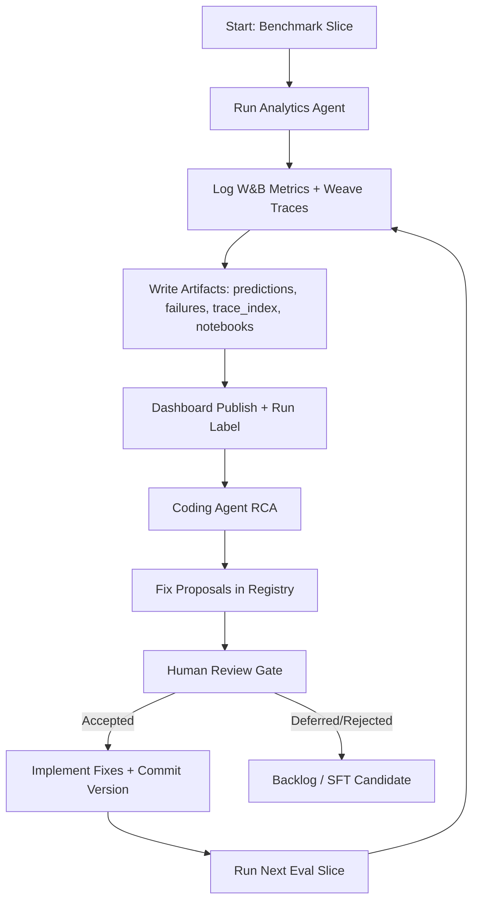

# Self-Evolving Analytics Agent (Submission)

Last updated: 2026-03-01

## What We Did

We built and tested an end-to-end improvement loop for an analytics agent on Spider:
1. Built agent + tools (`execute_sql`, `run_python`) with notebook/tool-call evidence.
2. Added W&B + Weave observability with per-question artifacts and run-level dashboards.
3. Ran benchmark slices, generated per-run RCA, and tracked fixes in a registry.
4. Enforced a human approval gate before promoting fixes to new eval runs.
5. Packaged the workflow into reusable skills for future coding-agent automation.

## Eval Loop Flow

## How We Used Coding Agent + Skills + MCP

1. Coding agent handled implementation, RCA evidence extraction, and fix proposal drafting.
2. Skills package codified repeatable steps (project bootstrap, tracing, eval, RCA gate, version mapping).
3. MCP/W&B tools were used for project/run validation and trace/dashboard operations.
4. Human remained final decision maker for fix acceptance to avoid overfitting.

## How Skills Guide Any Coding Agent

The `skills/` hierarchy is designed as an execution playbook that any coding agent can follow.

1. `skills/skills.md` is the entrypoint that routes the agent to the right topic skill.
2. Each topic `SKILL.md` defines deterministic workflow steps and guardrails.
3. Together, these skills let a coding agent:
   - bootstrap correct W&B project/entity values,
   - enable tracing/artifacts consistently,
   - run eval slices and publish dashboards,
   - perform RCA with human approval gating,
   - map code versions to run outcomes for reproducible iteration.
4. This makes the eval loop transferable to other analytics or coding agents, not tied only to this project.

## Runs And Outcomes

| Run Label | W&B Run ID | Slice | Agent SHA | Correct / Total | Accuracy | Summary |
|---|---|---|---|---:|---:|---|
| run_1 | xk2hr6zt | offset 0, limit 100 | 1844c71 | 21 / 100 | 0.21 | Baseline |
| run_2 | ank4a2aw | offset 0, limit 100 | 34d75d4 | 69 / 100 | 0.69 | Big gain after contract/tool fixes |
| run_3 | 9xild9wl | offset 100, limit 100 | e6d031a | 37 / 100 | 0.37 | Different slice exposed generalization gaps |

## Fixes And Impact

| Fix ID | Type | Status | Change | Observed Effect |
|---|---|---|---|---|
| fix-0201 | architecture_change | implemented | Normalize non-scalar `answer_value` | Removed `answer_shape_mismatch` in run_2 |
| fix-0202 | tool_design | implemented | SQL error assist (table/column suggestions) | Removed `tool_error_unresolved` in run_2 |
| fix-0204 | architecture_change | accepted + implemented | Ground `answer_value` from executed SQL | Included in run_3 |
| fix-0205 | prompt_update | accepted + implemented | Final-answer execution guard | Included in run_3 |
| fix-0206 | needs_model_training | deferred | Route persistent semantic misses to SFT | Kept as escalation path |

## Key Learnings

1. Contract and tool-recovery fixes can yield fast wins.
2. Cross-slice testing is mandatory; same-slice gains can hide weak generalization.
3. Human-gated RCA is necessary to prevent brittle one-off prompt patches.

## Submission Assets

1. Skills index: `skills/skills.md`
2. Skills folders: `skills/01-*` to `skills/07-*`
3. Fix workflow gate: `analytics-agent/FIXES_README.md`
4. RCA summaries:
   - `analytics-agent/outputs/improvement/rca_failures_ank4a2aw_summary.json`
   - `analytics-agent/outputs/improvement/rca_failures_9xild9wl_summary.json`
5. Next backlog (separate from presentation): `docs/submission-next-todo.md`
