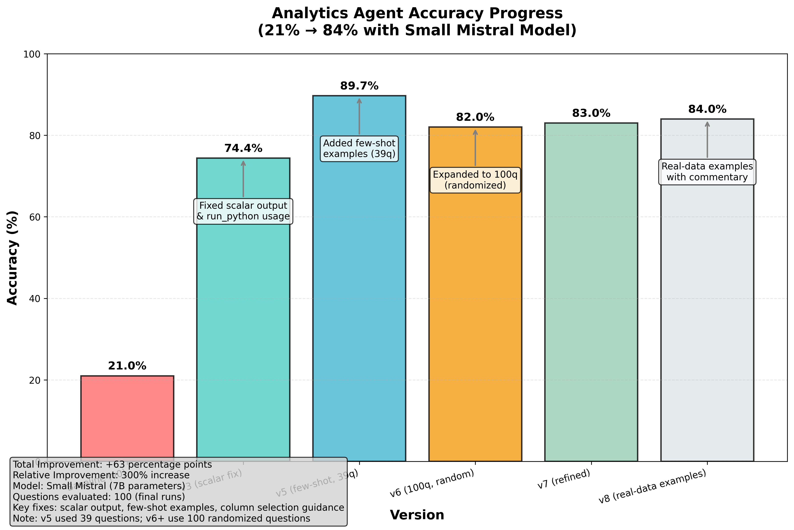
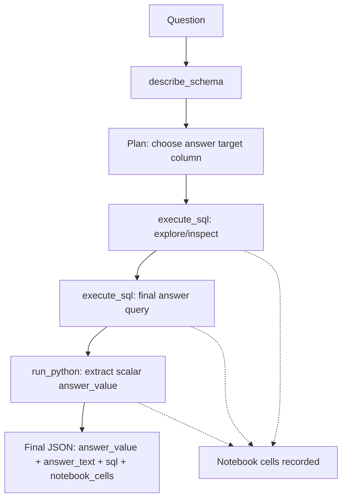
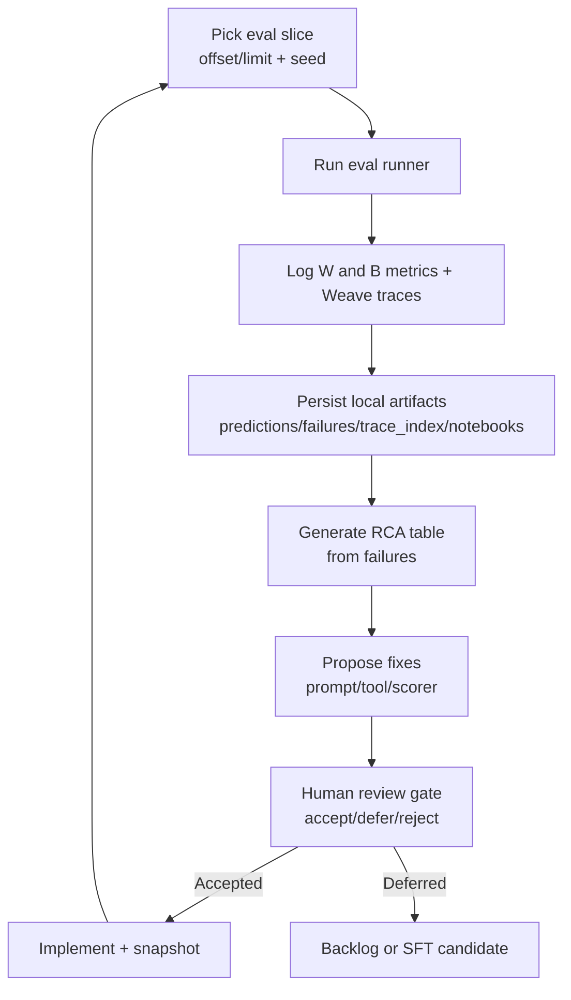

# Self-Evolving Analytics Agent (Research Project)

Last updated: 2026-03-12

This repo documents a research-style loop for improving a **SQLite analytics agent** on the Spider benchmark using:

- a **small Mistral model (7B)**
- tool-augmented execution (`describe_schema`, `execute_sql`, `run_python`)
- end-to-end **observability** (W&B metrics + per-question traces + notebooks)
- a structured **RCA → fix → re-eval** iteration process
- a reusable **skills package** that turns the loop into an execution playbook for any coding agent

## Headline Result: 21% → 84% Accuracy

Notes:
- The jump from **89.7% → 82.0%** happened when we expanded from a small curated slice (39 questions) to a **100-question randomized set**, exposing generalization gaps.

## What We Built

- **An analytics ReAct agent** that can inspect schema, write SQL, and post-process results in Python.
- **A scoring contract** that expects a scalar `answer_value` (the key driver behind many early failures).
- **Run artifacts for every eval**:
  - `predictions.jsonl`
  - `failures.jsonl`
  - `trace_index.jsonl`
  - `notebooks.jsonl` (tool + SQL + python "cells")
- **A fix registry + human approval gate** so we avoid overfitting and keep changes explainable.
- **A skill pack** (`skills/`) that encodes the repeatable W&B + eval + RCA workflows.

## Agent Execution Flow (Tool + Notebook Style)

Key idea: SQL does the heavy lifting (joins/filters/aggregations). `run_python` exists to make the output contract reliable (scalar extraction, formatting, light post-processing).

## Eval + RCA Improvement Loop

## Skills: Making the Loop Reusable

The `skills/` folder is an execution playbook so a coding agent can reproduce the exact loop on a new codebase.

- Entry point: `skills/skills.md`
- Topic skills:
  - `skills/wandb-projects/`
  - `skills/wandb-runs/`
  - `skills/wandb-traces/`
  - `skills/wandb-evals/`
  - `skills/wandb-reports/`
  - `skills/coding-agent-self-eval/` (orchestration + human gate)

Skills PR: https://github.com/wandb/wandb-mcp-server/pull/24

## Runs And Outcomes (W&B slice runs)

This table is the **W&B run history across Spider slices** (`run_1..run_4`). For the accuracy story shown in `accuracy_progress.png`, see **Prompt-Iteration Accuracy Timeline** below (v0–v8).

| Run Label | W&B Run ID | Slice | Agent SHA | Correct / Total | Accuracy | Summary |
|---|---|---|---|---:|---:|---|
| run_1 | xk2hr6zt | offset 0, limit 100 | 1844c71 | 21 / 100 | 0.21 | Baseline |
| run_2 | ank4a2aw | offset 0, limit 100 | 34d75d4 | 69 / 100 | 0.69 | Big gain after contract/tool fixes |
| run_3 | 9xild9wl | offset 100, limit 100 | e6d031a | 37 / 100 | 0.37 | Different slice exposed generalization gaps |
| run_4 | 0uz4zvcz | offset 200, limit 100 | eeef51e | 53 / 100 | 0.53 | After schema tool + SQL no-case recovery; improved over run_3 |

### Prompt-Iteration Accuracy Timeline (matches the chart)

The chart (`accuracy_progress.png`) is a **prompt/tool-contract iteration timeline**. It is **not the same** as the multi-slice W&B runs above.

| Version | Eval set | Accuracy | What changed |
|---|---|---:|---|
| v0 | 100q | 21.0% | Baseline prompt + weak scalar contract |
| v3 | 100q | 74.4% | Enforced scalar `answer_value` and taught `run_python` extraction |
| v5 | 39q | 89.7% | Added few-shot examples (small curated slice) |
| v6 | 100q randomized | 82.0% | Expanded to a larger randomized set (generalization gap surfaced) |
| v7 | 100q randomized | 83.0% | Refined examples: deterministic ordering + safer joins + column selection |
| v8 | 100q randomized | 84.0% | Real-data examples + explicit step-by-step reasoning for column extraction |

## Fixes And Impact

This table summarizes the fixes/changes that drove the accuracy jumps shown in `accuracy_progress.png`.

| Fix / Change | Category | Where | Why it mattered | Seen in |
|---|---|---|---|---|
| Scalar `answer_value` contract | Prompt + contract | `analytics-agent/agent/prompt.py` | Stopped list/dict answers and made scoring comparable across runs | v3+ |
| Always extract the scalar via `run_python` | Tooling pattern | `run_python` tool + prompt examples | Prevented “right SQL, wrong output shape” and wrong-column outputs | v3+ |
| Few-shot examples | Prompt | `analytics-agent/agent/prompt.py` | Reduced SQL shape errors by showing the exact tool-call sequence and JSON shape | v5+ |
| Deterministic `ORDER BY` when multiple rows are valid | Prompt | `analytics-agent/agent/prompt.py` | Reduced row-order sensitivity where the scorer checks the first row | v7+ |
| Commentary on *which* column index to extract and *why* | Prompt | `analytics-agent/agent/prompt.py` | Reduced wrong-column extraction (e.g. `rows[0][0]` vs `rows[0][1]`) | v8 |

Interpretation of the v5 → v6 drop:
- v5’s 89.7% was on **39 questions**.
- v6 moved to **100 randomized questions**, which included more ambiguous/edge cases (row-order sensitivity, column confusion, multi-join traps).

## Key Learnings

1. Contract and tool-recovery fixes can yield fast wins.
2. Cross-slice testing is mandatory; same-slice gains can hide weak generalization.
3. Human-gated RCA is necessary to prevent brittle one-off prompt patches.

## Submission Assets

1. Skills index: `skills/skills.md`
2. Skills folders: `skills/wandb-*` + `skills/coding-agent-self-eval/`
3. W&B MCP skills PR: `https://github.com/wandb/wandb-mcp-server/pull/24`
4. Fix workflow gate: `analytics-agent/FIXES_README.md`
5. RCA summaries:
   - `analytics-agent/outputs/improvement/rca_failures_ank4a2aw_summary.json`
   - `analytics-agent/outputs/improvement/rca_failures_9xild9wl_summary.json`
6. Next backlog (separate from presentation): `docs/submission-next-todo.md`

## Run-Centric Demo Data

Use this path during demo so judges can navigate by run label instead of run ID:

1. `analytics-agent/outputs/runs/README.md`
2. `analytics-agent/outputs/runs/run_1/`
3. `analytics-agent/outputs/runs/run_2/`
4. `analytics-agent/outputs/runs/run_3/`
5. `analytics-agent/outputs/runs/run_4/`

Each run folder contains:
1. `README.md` (what happened in that run)
2. `metadata.json` (run id/url/metrics/fix context)
3. `observability/` (predictions, failures, trace mapping, notebooks if available)
4. `rca/` (RCA rows and summary)
